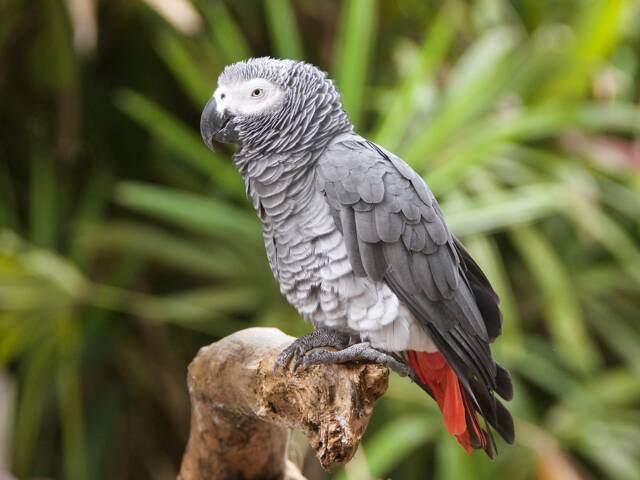

# Perroquet qui parle le plus facilement à élever : guide complet

Vous rêvez d'adopter un **perroquet qui parle facilement** et cherchez l'espèce idéale pour débuter ? Ce guide complet vous présente les meilleures espèces de perroquets parleurs, leurs caractéristiques, et tous les conseils pour réussir leur éducation vocale. Les perroquets comptent parmi les animaux de compagnie exotiques les plus fascinants, notamment pour leur capacité à imiter la voix humaine et à apprendre un vocabulaire parfois impressionnant.

## Pourquoi certains perroquets parlent-ils mieux que d'autres ?

Avant de découvrir quelles espèces constituent le meilleur **perroquet qui parle facilement**, il est important de comprendre ce qui influence cette capacité :

- **Anatomie vocale** : Certaines espèces possèdent un syrinx (organe vocal) plus développé
- **Intelligence** : Les espèces plus intelligentes apprennent généralement plus de mots
- **Sociabilité** : Les perroquets très sociaux sont plus enclins à communiquer
- **Âge d'acquisition** : Les jeunes oiseaux apprennent généralement plus facilement
- **Génétique** : Certains individus ont naturellement plus de facilité, même au sein d'une même espèce

## Top 5 des perroquets qui parlent le plus facilement

### 1. Gris du Gabon (Psittacus erithacus)

**Capacité de parole** : ★★★★★

Le Gris du Gabon est unanimement reconnu comme le meilleur **perroquet qui parle facilement**. Sa capacité à reproduire la voix humaine est exceptionnelle, tant en clarté qu'en compréhension contextuelle.

**Caractéristiques :**
- Vocabulaire potentiel : 800-1000 mots
- Excellente prononciation et intonation
- Capacité à associer les mots à leur signification
- Intelligence comparable à celle d'un enfant de 4-5 ans
- Peut apprendre à compter et identifier des couleurs

**Considérations pour débutants :**
- Prix : 800-1500€
- Espérance de vie : 50-70 ans
- Niveau de bruit : Modéré
- Espace requis : Grand (cage minimum 80x80x120 cm)
- Temps d'interaction quotidienne : 3-4 heures minimum
- Difficulté d'entretien : Modérée à élevée

[Voir les cages recommandées pour Gris du Gabon](#) <!-- Lien d'affiliation -->

### 2. Amazone à front bleu (Amazona aestiva)

**Capacité de parole** : ★★★★☆

L'Amazone à front bleu est souvent recommandée comme **perroquet qui parle facilement** pour les débutants en raison de son caractère plus stable.

**Caractéristiques :**
- Vocabulaire potentiel : 200-300 mots
- Voix claire et distincte
- Excellente capacité à imiter les chansons
- Personnalité enjouée et extravertie
- Moins susceptible aux problèmes comportementaux que d'autres espèces

**Considérations pour débutants :**
- Prix : 700-1200€
- Espérance de vie : 40-50 ans
- Niveau de bruit : Élevé (particulièrement le matin et le soir)
- Espace requis : Moyen à grand (cage minimum 70x70x100 cm)
- Temps d'interaction quotidienne : 2-3 heures
- Difficulté d'entretien : Modérée

[Voir les cages recommandées pour Amazone](#) <!-- Lien d'affiliation -->

### 3. Youyou du Sénégal (Poicephalus senegalus)

**Capacité de parole** : ★★★☆☆

Le Youyou est un excellent compromis pour ceux qui recherchent un **perroquet qui parle facilement** mais disposent d'un espace limité.

**Caractéristiques :**
- Vocabulaire potentiel : 50-100 mots
- Voix claire mais moins variée
- Taille compacte (25-30 cm)
- Caractère affectueux et joueur
- Moins bruyant que les grandes espèces

**Considérations pour débutants :**
- Prix : 400-700€
- Espérance de vie : 25-30 ans
- Niveau de bruit : Faible à modéré
- Espace requis : Modéré (cage minimum 60x60x80 cm)
- Temps d'interaction quotidienne : 1-2 heures
- Difficulté d'entretien : Facile à modérée

[Voir les cages recommandées pour Youyou](#) <!-- Lien d'affiliation -->

### 4. Perruche calopsitte (Nymphicus hollandicus)

**Capacité de parole** : ★★☆☆☆

La calopsitte est souvent le premier choix des débutants absolus cherchant un **perroquet qui parle facilement** à petit budget.

**Caractéristiques :**
- Vocabulaire potentiel : 20-30 mots
- Voix sifflante, moins claire que les grandes espèces
- Excellente capacité à siffler des mélodies
- Taille très compacte (30-33 cm avec la queue)
- Caractère doux et sociable

**Considérations pour débutants :**
- Prix : 50-100€
- Espérance de vie : 15-20 ans
- Niveau de bruit : Faible (sauf périodes de chant)
- Espace requis : Petit à moyen (cage minimum 50x50x60 cm)
- Temps d'interaction quotidienne : 1 heure
- Difficulté d'entretien : Très facile

[Voir les cages recommandées pour Calopsitte](#) <!-- Lien d'affiliation -->

### 5. Perroquet Eclectus (Eclectus roratus)

**Capacité de parole** : ★★★★☆

L'Eclectus est un **perroquet qui parle facilement** avec une voix particulièrement mélodieuse et claire.

**Caractéristiques :**
- Vocabulaire potentiel : 100-250 mots
- Voix très claire et mélodieuse
- Dimorphisme sexuel prononcé (mâles verts, femelles rouges)
- Intelligence élevée
- Tempérament calme comparé à d'autres grandes espèces

**Considérations pour débutants :**
- Prix : 800-1200€
- Espérance de vie : 30-40 ans
- Niveau de bruit : Modéré
- Espace requis : Grand (cage minimum 80x80x120 cm)
- Temps d'interaction quotidienne : 2-3 heures
- Difficulté d'entretien : Modérée à élevée (régime alimentaire spécifique)

[Voir les cages recommandées pour Eclectus](#) <!-- Lien d'affiliation -->

## Comment apprendre à parler à votre perroquet

Posséder un **perroquet qui parle facilement** ne garantit pas qu'il développera cette capacité sans entraînement. Voici les meilleures techniques pour favoriser l'apprentissage vocal :

### Créer un environnement propice

- **Emplacement stratégique** : Placez la cage dans une pièce fréquentée mais calme
- **Routine stable** : Maintenez des horaires réguliers pour les interactions
- **Stimulation** : Offrez des jouets variés et changez-les régulièrement
- **Sécurité** : Assurez-vous que l'oiseau se sent en sécurité dans son environnement

### Techniques d'apprentissage efficaces

1. **Répétition constante** : Répétez les mêmes mots ou phrases quotidiennement
2. **Sessions courtes** : Pratiquez 10-15 minutes plusieurs fois par jour
3. **Moments opportuns** : Enseignez quand l'oiseau est alerte (généralement le matin)
4. **Enthousiasme** : Utilisez une voix enjouée et expressive
5. **Récompenses** : Offrez des friandises ou des caresses après les succès
6. **Association** : Liez les mots à des actions ou objets concrets
7. **Patience** : Certains perroquets mettent des mois avant de prononcer leur premier mot

### Premiers mots à enseigner

Les meilleurs mots pour débuter sont :
- Courts (1-2 syllabes)
- Contenant des voyelles ouvertes (a, o)
- Faciles à associer à des actions quotidiennes
- Exemples : "Coucou", "Bonjour", "Salut", le nom de l'oiseau

## Budget et coût d'entretien

Adopter un **perroquet qui parle facilement** représente un investissement significatif :

### Coût initial

| Élément | Fourchette de prix |
|---------|-------------------|
| Oiseau | 50-1500€ selon l'espèce |
| Cage adaptée | 100-500€ |
| Accessoires (perchoirs, jouets) | 50-150€ |
| Mangeoires et abreuvoirs | 20-50€ |
| Première consultation vétérinaire | 50-80€ |
| **Total** | **270-2280€** |

### Coût mensuel

| Dépense | Coût mensuel estimé |
|---------|---------------------|
| Alimentation de qualité | 20-60€ |
| Friandises et compléments | 10-20€ |
| Jouets (renouvellement) | 10-30€ |
| Litière/papier de fond | 5-10€ |
| Économies pour soins vétérinaires | 15-30€ |
| **Total mensuel** | **60-150€** |

## Considérations importantes avant adoption

Avant d'adopter un **perroquet qui parle facilement**, réfléchissez à ces aspects essentiels :

### Engagement à long terme
La plupart des perroquets vivent plusieurs décennies, certains pouvant même vous survivre.

### Besoins sociaux
Les perroquets sont des animaux extrêmement sociaux qui souffrent de solitude et peuvent développer des troubles comportementaux s'ils sont négligés.

### Bruit
Même les espèces les plus calmes sont vocales par nature. Êtes-vous prêt à accepter les vocalisations quotidiennes ?

### Espace
Une cage adaptée occupe un espace considérable, et l'oiseau aura besoin de temps hors de sa cage chaque jour.

### Propreté
Les perroquets génèrent beaucoup de poussière de plumes et projettent des débris alimentaires autour de leur cage.

### Législation
Vérifiez la réglementation concernant la détention d'espèces exotiques dans votre pays ou région.

## Conclusion

Choisir le **perroquet qui parle facilement** idéal pour votre situation demande une réflexion approfondie. Si le Gris du Gabon reste le champion incontesté en matière de capacités vocales, d'autres espèces comme l'Amazone à front bleu ou le Youyou du Sénégal peuvent constituer d'excellents choix pour les débutants, offrant un bon équilibre entre capacités vocales et facilité d'entretien.

Quel que soit votre choix, rappelez-vous que la capacité de parole ne devrait jamais être l'unique critère de sélection. La compatibilité avec votre mode de vie, l'espace disponible et votre capacité à répondre aux besoins de l'oiseau pendant plusieurs décennies sont des facteurs tout aussi importants.

Êtes-vous prêt à accueillir un compagnon à plumes bavard dans votre vie ? Avec les bonnes connaissances et un engagement sincère, cette relation peut devenir l'une des plus enrichissantes qui soit.

## Articles recommandés
- [Meilleure cage pour toui céleste en appartement](/articles/oiseaux-exotiques/meilleure-cage-pour-toui-celeste-en-appartement)
- [Alimentation naturelle pour loriquet arc-en-ciel](/articles/oiseaux-exotiques/alimentation-naturelle-pour-loriquet-arc-en-ciel)
- [Comment voyager avec un animal exotique légalement](/articles/guides-pratiques/comment-voyager-avec-un-animal-exotique-legalement)

<!-- Emplacement pour Google AdSense -->
<!-- Bannière publicitaire -->

*Dernière mise à jour : Juin 2025*
