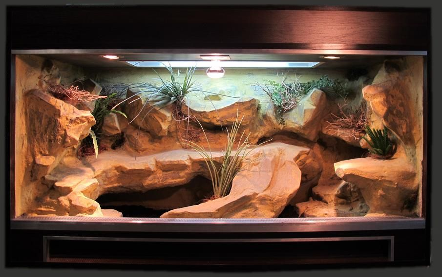

# Meilleur terrarium pour gecko léopard débutant : guide d'achat complet

Vous envisagez d'adopter un gecko léopard et vous vous demandez quel **terrarium pour gecko léopard débutant** choisir ? Ce guide complet vous aidera à sélectionner l'habitat idéal pour votre futur compagnon reptilien. Le gecko léopard (*Eublepharis macularius*) est l'un des reptiles les plus populaires pour les débutants en raison de sa facilité d'entretien, sa longévité et son caractère docile. Cependant, lui offrir un environnement adapté est essentiel pour son bien-être.

## Pourquoi le choix du terrarium est crucial pour votre gecko léopard

Le terrarium n'est pas un simple contenant, c'est l'environnement de vie complet de votre animal. Un **terrarium pour gecko léopard débutant** bien conçu permettra de :

- Maintenir les paramètres environnementaux optimaux (température, humidité)
- Offrir suffisamment d'espace pour l'exercice et l'exploration
- Faciliter le nettoyage et l'entretien quotidien
- Permettre une observation agréable de votre animal
- Prévenir les évasions et assurer la sécurité du gecko

## Taille idéale du terrarium pour gecko léopard

### Dimensions recommandées

Pour un gecko léopard adulte, les dimensions minimales recommandées sont :
- Longueur : 60 cm
- Largeur : 40 cm
- Hauteur : 30 cm

Ce qui correspond à un volume d'environ 70-80 litres. Contrairement à d'autres reptiles, les geckos léopards sont principalement terrestres et préfèrent l'espace au sol plutôt qu'en hauteur.

### Évolution selon l'âge

- **Juvénile** (moins de 6 mois) : Un terrarium plus petit (40x30x30 cm) peut convenir temporairement pour faciliter la recherche de nourriture
- **Adulte** : Minimum 60x40x30 cm
- **Cohabitation** : Ajouter 30% d'espace pour chaque gecko supplémentaire (déconseillé pour les débutants)

## Matériaux : avantages et inconvénients

### Terrarium en verre

**Avantages :**
- Excellente visibilité
- Facile à nettoyer
- Conserve bien la chaleur
- Esthétique
- Résistant aux rayures

**Inconvénients :**
- Plus lourd
- Plus fragile
- Prix plus élevé
- Moins bonne isolation thermique

### Terrarium en plastique

**Avantages :**
- Léger
- Incassable
- Moins coûteux
- Meilleure isolation thermique

**Inconvénients :**
- Se raye facilement
- Visibilité réduite avec le temps
- Moins esthétique
- Peut absorber les odeurs

### Terrarium en bois avec façade vitrée

**Avantages :**
- Excellente isolation thermique
- Aspect naturel et esthétique
- Solide et durable

**Inconvénients :**
- Plus difficile à nettoyer
- Risque de moisissure si mal entretenu
- Prix généralement plus élevé
- Plus lourd

## Notre sélection des meilleurs terrariums pour gecko léopard débutant

### 1. Exo Terra Glass Terrarium (60x45x30 cm)

**Prix indicatif :** 120-150€

**Points forts :**
- Portes frontales pour un accès facile
- Ventilation supérieure ajustable
- Fond surélevé pour installer un tapis chauffant
- Entrées pour câbles et tuyaux
- Design naturel avec paroi arrière texturée

**Idéal pour :** Les débutants souhaitant un terrarium complet et bien conçu

[Voir le prix sur Amazon](#) <!-- Lien d'affiliation -->

### 2. Repti-Home Terrarium en verre (60x45x45 cm)

**Prix indicatif :** 90-120€

**Points forts :**
- Excellent rapport qualité/prix
- Assemblage facile
- Bonne ventilation
- Accès par le haut et par l'avant

**Idéal pour :** Les débutants avec un budget limité

[Voir le prix sur Amazon](#) <!-- Lien d'affiliation -->

### 3. Komodo Wooden Vivarium (61x46x46 cm)

**Prix indicatif :** 150-180€

**Points forts :**
- Excellente isolation thermique
- Aspect esthétique supérieur
- Très durable
- Façade vitrée coulissante

**Idéal pour :** Les débutants prêts à investir dans un habitat durable et esthétique

[Voir le prix sur Amazon](#) <!-- Lien d'affiliation -->

### 4. Trixie ReptiHome Terrarium en verre (60x35x35 cm)

**Prix indicatif :** 80-100€

**Points forts :**
- Prix très accessible
- Facile à monter
- Portes coulissantes pratiques
- Bonne ventilation

**Idéal pour :** Les débutants avec un budget très serré

[Voir le prix sur Amazon](#) <!-- Lien d'affiliation -->

## Équipements essentiels à ajouter dans votre terrarium

Un **terrarium pour gecko léopard débutant** doit être correctement équipé pour recréer l'environnement naturel de l'animal :

### Chauffage

- **Tapis chauffant** : À placer sous un tiers du terrarium (côté chaud)
- **Thermostat** : Indispensable pour réguler la température
- **Thermomètre digital** : Pour surveiller la température des deux côtés

### Éclairage

- **Lampe LED** : Pour un cycle jour/nuit naturel (10-12h/jour)
- **Pas de lampe UVB nécessaire** : Les geckos léopards sont nocturnes et n'en ont pas besoin

### Substrat

- **Options recommandées** : Papier essuie-tout (débutants), substrat terrestre sans particules fines, tapis reptile
- **À éviter absolument** : Sable, écorces, substrats particulaires fins (risque d'impaction)

### Cachettes et enrichissement

- Minimum 3 cachettes (zone chaude, zone froide, zone humide)
- Branches et rochers pour grimper
- Plantes artificielles pour l'enrichissement
- Bol d'eau peu profond

## Installation et aménagement du terrarium

### Création d'un gradient thermique

L'un des aspects les plus importants d'un **terrarium pour gecko léopard débutant** est le gradient thermique :
- **Zone chaude** : 30-32°C (jour) / 25-27°C (nuit)
- **Zone froide** : 24-26°C (jour) / 20-22°C (nuit)

### Étapes d'installation

1. Placer le tapis chauffant sous un tiers du terrarium
2. Installer le thermostat et les thermomètres
3. Disposer le substrat (5-7 cm d'épaisseur)
4. Placer les cachettes dans les différentes zones
5. Ajouter les éléments de décor et d'enrichissement
6. Installer l'éclairage
7. Laisser le terrarium se stabiliser 24-48h avant d'introduire le gecko

## Budget total pour un terrarium complet

Pour un débutant, voici une estimation du budget nécessaire pour un habitat complet :

| Élément | Prix estimé |
|---------|-------------|
| Terrarium | 90-150€ |
| Tapis chauffant | 20-30€ |
| Thermostat | 25-40€ |
| Thermomètres (x2) | 15-20€ |
| Éclairage LED | 20-40€ |
| Substrat | 10-25€ |
| Cachettes (x3) | 15-30€ |
| Décoration | 20-50€ |
| Bol d'eau et nourriture | 5-10€ |
| **TOTAL** | **220-395€** |

## Erreurs courantes à éviter pour les débutants

1. **Choisir un terrarium trop petit** : Un espace insuffisant entraîne stress et problèmes de santé
2. **Négliger le thermostat** : Un tapis chauffant sans régulation peut causer des brûlures
3. **Utiliser un substrat inadapté** : Le sable peut provoquer des impactions mortelles
4. **Placer trop peu de cachettes** : Les geckos léopards ont besoin de se sentir en sécurité
5. **Négliger l'hygrométrie** : Une zone humide est nécessaire pour la mue

## Entretien du terrarium

### Entretien quotidien
- Retirer les excréments et la nourriture non consommée
- Vérifier les températures
- Remplir le bol d'eau

### Entretien hebdomadaire
- Nettoyer le bol d'eau
- Vérifier l'humidité de la boîte à mue
- Retirer les aliments morts non consommés (insectes)

### Entretien mensuel
- Nettoyage complet du terrarium
- Désinfection des décors
- Remplacement partiel du substrat

## Conclusion

Choisir le bon **terrarium pour gecko léopard débutant** est la première étape cruciale pour assurer le bien-être de votre nouveau compagnon. En investissant dans un habitat de qualité et en l'équipant correctement, vous offrirez à votre gecko léopard les meilleures conditions pour s'épanouir pendant de nombreuses années. N'oubliez pas que le terrarium représente l'environnement complet de votre animal, il mérite donc une attention particulière.

Avant d'acquérir votre gecko léopard, assurez-vous que son habitat est complètement installé et fonctionnel. Votre reptile vous remerciera par sa bonne santé et sa longévité, qui peut atteindre 15 à 20 ans avec des soins appropriés !

## Articles recommandés
- [Prix d'un dragon barbu et entretien mensuel](/articles/reptiles-amphibiens/prix-dun-dragon-barbu-et-entretien-mensuel)
- [Quelle lampe UV choisir pour un reptile tropical](/articles/guides-pratiques/quelle-lampe-uv-choisir-pour-un-reptile-tropical)
- [Quels animaux exotiques sont autorisés en France](/articles/mammiferes-rares/quels-animaux-exotiques-sont-autorises-en-france)

<!-- Emplacement pour Google AdSense -->
<!-- Bannière publicitaire -->

*Dernière mise à jour : Juin 2025*
